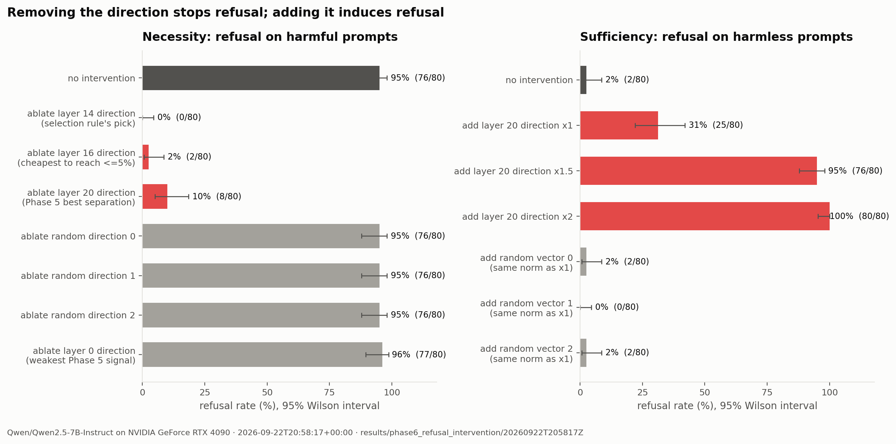

<div align="center">

# Local LLM Lab

**Measuring, speeding up and taking apart a 7B language model on one consumer GPU.**

[](https://github.com/ethanstoner/local-llm-lab/actions/workflows/tests.yml)


-2ea44f)


</div>


A measurement framework for open-weight language models, run on `Qwen2.5-7B-Instruct`
and an RTX 4090. It asks where inference time goes, how close the implementation runs to
what the hardware allows, and whether the model's refusal behaviour runs through a single
direction inside the network - then acts on the answers.

Every empirical result comes from a recorded run, stored alongside the hardware, software
versions, git commit and config that produced it, and every figure is drawn from those
files. Analytical quantities - the roofline ceilings - are labelled as modelled.

| | |
|---|---|
| **Faster decoding** | A new decode-attention path: **1.57x** faster at 16k context, **1.65x** at batch 32, with no measurable fidelity regression against an FP32-attention reference |
| **Explained performance** | A roofline with no fitted parameters: the old attention path runs at a steady 68-80% of it at every context length and batch size |
| **Causal interpretability** | Removing one direction takes refusal from **95% to 0%**; adding it takes harmless-prompt refusal from **3% to 100%**; random directions do nothing |
| **Rigor** | Paired ABBA benchmarks, held-out splits, random controls, 95% intervals, FP32 reference checks |
| **Debugging** | Four silent-correctness bugs caught by the project's own measurement checks and fixed - including a padding-mask gap in how transformers handles custom attention backends |

---

## Key results

### 1. A faster decode path - 1.57x at 16k context, 1.65x at batch 32

Qwen2.5-7B uses grouped-query attention: 28 query heads share 4 key/value heads. On
Windows, PyTorch has no flash-attention kernel, and the working fallback copies the whole
KV cache seven times per layer for every generated token - at 16k context, about 6.6 GB of
copies written and read back again, per token.

The replacement stacks the seven query heads that share each KV head, so every cached key
and value is read exactly once - using PyTorch's memory-efficient kernel while the cache
is short and a float32-score grouped matmul once it is long. Measured with a paired,
order-balanced A/B on a desktop whose background load moved single measurements by more
than the effect itself:

| context | before (tok/s) | after (tok/s) | paired speed-up |
|---|---|---|---|
| 2k | 38.3 | 39.1 | 1.02x |
| 4k | 32.5 | 37.8 | 1.17x |
| 8k | 26.7 | 37.4 | 1.37x |
| 16k | 19.2 | 30.2 | **1.57x** |
| batch 32 at 512 tokens | 672 aggregate | 1120 aggregate | **1.65x** |


### 2. A roofline explains the slowdown

From the model config and measured hardware ceilings (947 GB/s read bandwidth,
157.5 TFLOP/s bf16), a byte count per generated token predicts how fast decoding *can*
run. The KV cache is only 0.9 GB at 16k context against 15.2 GB of weights, so an ideal
decoder would lose ~6% there - but throughput fell 56%. Modelling the extra copies
explains it: the old path holds a constant 68-80% of its modelled ceiling at every context
and batch size. That diagnosis is what pointed at the fix above.

### 3. Refusal runs through one direction - and the best place to see it is not the best place to cut it

Reproducing and extending Arditi et al. (2024). A direction fitted on 70 prompts per class
separates held-out harmful from harmless prompts with AUROC 0.99. Then, with
inference-time hooks:

- **Ablating it** takes refusal on harmful prompts from **95% to 0-2.5%** (layers 14-19).
  Three random directions leave it at 95%.
- **Adding it** makes the model refuse **100%** of harmless requests - including
  explaining how to use a fire extinguisher. Random vectors of the same size: 0-2.5%.
- The layers where the direction **separates** prompts best (21-24) are poor places to
  remove it: 30-65% of refusals survive and perplexity rises 25-36%. Layer 16's direction
  removes 97.5% of refusals at **no measurable perplexity cost**.
- At **1.5B**, adding the direction still induces refusal, but no layer removes it without
  damaging the model - the single-direction story holds cleanly at 7B and only partly at
  1.5B.



No weights are modified, no fitted directions are published, and completions to harmful
prompts are classified and discarded - only counts are stored.

### 4. Debugging highlights

Each of these was caught by a measurement and fixed. The two numerical bugs are guarded
by regression tests that were checked to fail on the original code.

- **Custom attention backends received no padding mask.** Transformers builds masks from a
  separate registry and silently passes none for unregistered names, so batched passes
  attended to padding. Fixed, and every affected phase re-run - which doubled nf4's
  measured quality loss.
- **bf16 attention scores cost up to 8 nats of KL** in an early version of the fast path,
  which looked right on speed and output text; an FP32-reference check caught it, and
  scores are now computed in float32.
- **A `.gitignore` rule for model weights also matched `src/models/`**, so the loader
  package was missing from the repository; fixed and verified from a fresh clone.
- **A regression test must fail on the bug it guards.** The first two written for the
  bf16 fix did not; the final one is built so bf16 cannot represent the correct answer.

---

## What this project demonstrates

- **GPU performance engineering** - tracing a 56% slowdown to one `repeat_kv` call with a
  roofline model and per-module timing, then writing and validating the replacement.
- **Experimental design** - paired, order-balanced A/B tests on a noisy machine; held-out
  evaluation; random controls; confidence intervals; layer selection by the original
  paper's criteria.
- **Numerical care** - FP32 reference checks, and regression tests proven to fail on the
  bugs they guard against.
- **Transformer internals and interpretability** - attention backends, KV caches, forward
  hooks, directional ablation and activation steering, at two model scales.
- **Software engineering** - validated configs, self-describing result directories, 172
  tests, lint and CI, figures regenerated from data with provenance captions.

---

## Deep dive

| document | contents |
|---|---|
| [**Full results**](docs/results.md) | every phase, table and figure, with the reasoning behind each conclusion |
| [**Methodology**](docs/methodology.md) | how each quantity is measured, and why the obvious alternative is wrong |
| [**Decode attention path**](src/models/attention.py) | the implementation, with per-layer timings in its docstring |
| [**Progress log**](PROGRESS.md) | what was done, what broke, and how it was diagnosed |

---

## Quick start

```powershell
powershell -ExecutionPolicy Bypass -File .\scripts\setup_env.ps1        # venv, torch 2.6 cu124, pinned stack
.\venv\Scripts\python.exe -m pytest tests/ -q                           # 172 tests, CPU-only, no network
powershell -ExecutionPolicy Bypass -File .\scripts\fetch_model.ps1 -Repo Qwen/Qwen2.5-7B-Instruct
powershell -ExecutionPolicy Bypass -File .\scripts\fetch_model.ps1 -Repo Qwen/Qwen2.5-1.5B-Instruct
powershell -ExecutionPolicy Bypass -File .\scripts\fetch_datasets.ps1
powershell -ExecutionPolicy Bypass -File .\scripts\run_all.ps1          # every phase, then the figures
```

Each phase also runs on its own - for example
`python -m src.benchmarks.interleaved --config configs/decode_ab.yaml` for the decode A/B.
Every phase's command is listed in [scripts/run_all.ps1](scripts/run_all.ps1).

```
src/
├── models/           loader, precision registry, OOM guard, attention backends (incl. the new decode path)
├── benchmarks/       timing primitives, sweeps, paired A/B harness, hardware ceilings
├── analysis/         roofline model over finished result files
├── interpretability/ activation hooks, refusal direction, ablation and addition, causal runner
├── evaluation/       quantization fidelity metrics
├── monitoring/       NVML sampler thread, allocator accounting
├── visualization/    figures and the render CLI
└── utils/            strict YAML configs, seeding, run metadata, IO
```

**Hardware:** RTX 4090 (24 GB), Windows 11, Python 3.12, torch 2.6.0+cu124,
transformers 4.57.0. **Limitations:** one GPU, one model family, a working desktop rather
than a quiet benchmarking rig, and `transformers.generate` rather than a serving stack -
see [docs/results.md](docs/results.md#9-limitations).

---

## Scope and intent

The interpretability work reproduces a published result - that safety fine-tuning in chat
models is mediated by a single removable direction - because it shows how shallow this
form of alignment is. The implementation stays on the measurement side: interventions are
inference-time hooks removed after every condition, nothing is written to the weights, no
modified weights or fitted directions are published, and harmful-prompt completions are
never stored.

## License

[MIT](LICENSE).
