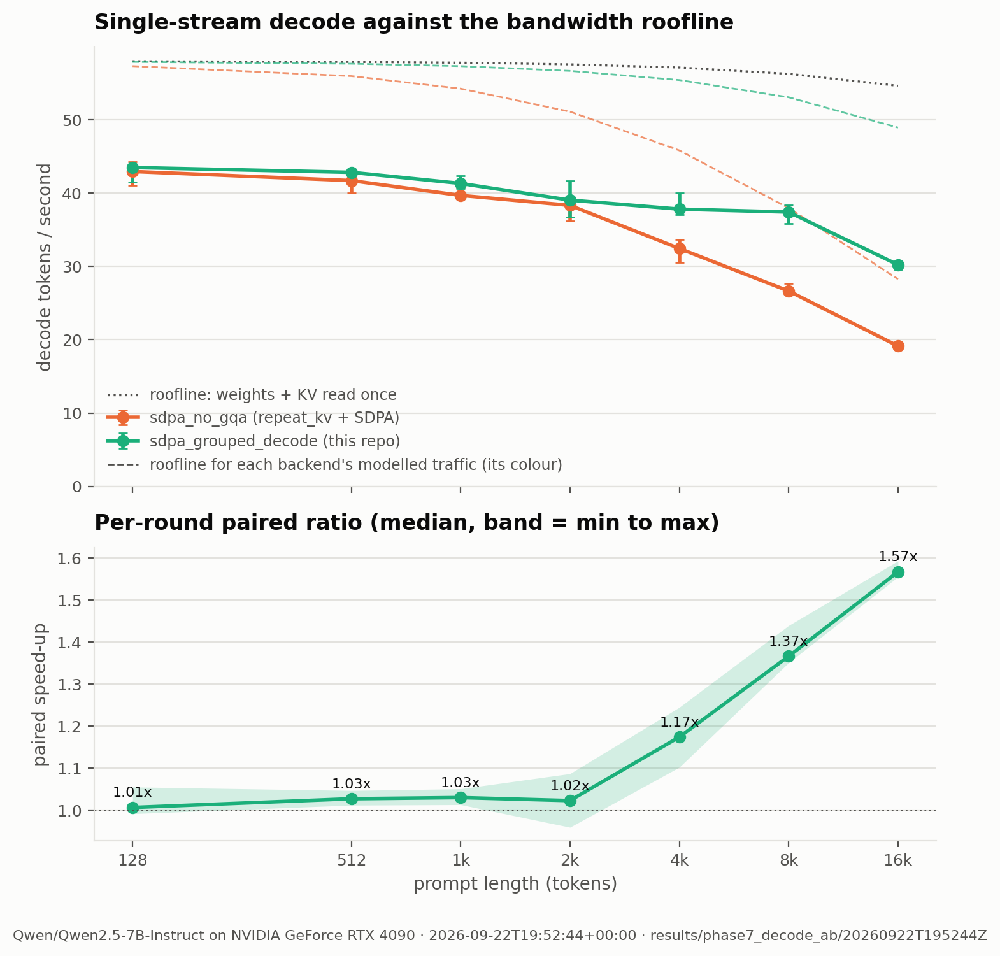
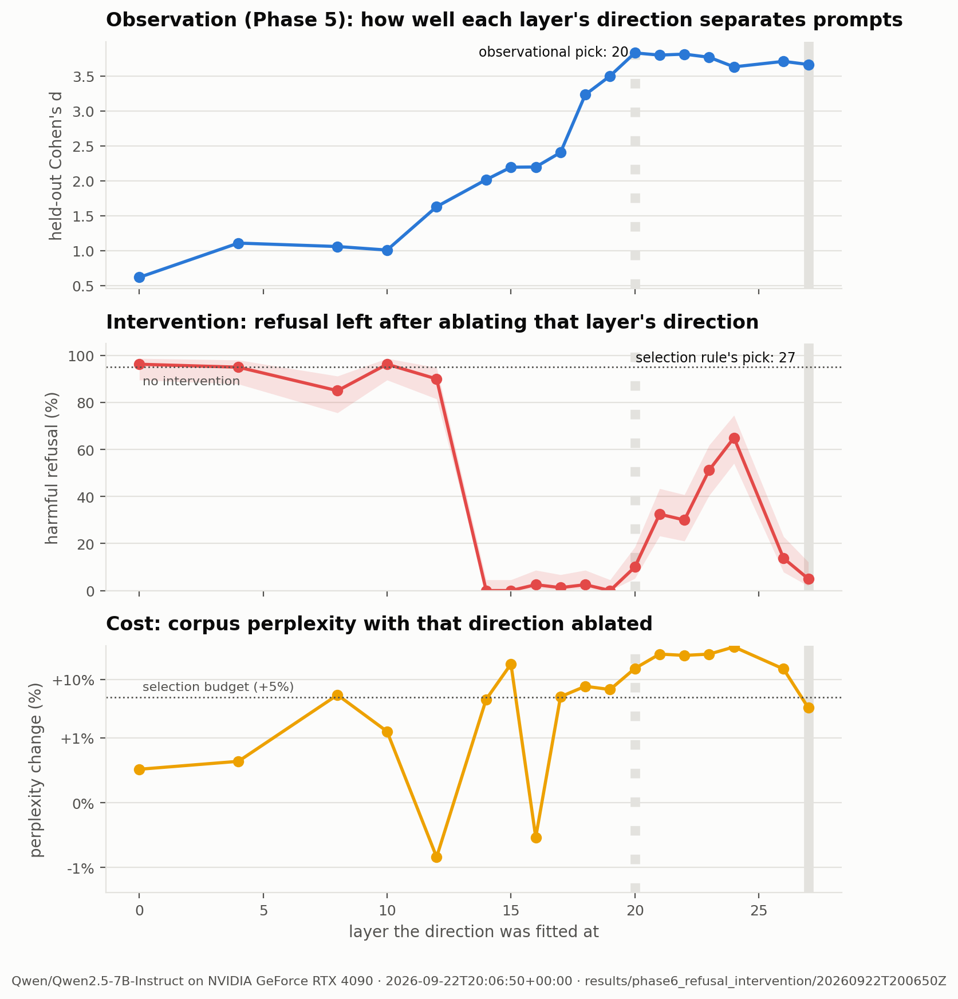

# Local LLM Lab

A measurement framework for open-weight language models on one consumer GPU: where the
time goes, what quantization costs, how close inference runs to what the hardware
allows, and whether a model's refusal behaviour runs through a single direction in its
residual stream.

It is not a chat interface or a wrapper around a serving runtime. Its output is data:
structured result files, GPU telemetry and figures, every number measured on the
hardware below. Nothing is estimated, and configurations that could not run are
reported as such.

**Subject:** `Qwen/Qwen2.5-7B-Instruct` in bf16 on an RTX 4090 (24 GB), with the interpretability
phases replicated at 1.5B. **Stack:** PyTorch 2.6, transformers 4.57, bitsandbytes.
**Tests:** 169, CPU-only, network-free.

---

## Headline results

**1. A decode-attention path 1.57x faster at 16k context.** On Windows, where PyTorch has
no flash-attention kernel, grouped-query attention falls back to copying the whole KV
cache seven times per layer per token. A decode path that reads each key and value once
is **1.57x faster at 16k context and 1.65x at batch 32**, never meaningfully slower, and
as close to a float32-attention reference as the kernel it replaces. It is measured with
a paired, order-balanced A/B, because two separate sweeps on this desktop disagreed with
each other by more than the effect. [§4](#4-a-faster-decode-path-phases-7-and-8)



**2. A roofline with no free parameters explains the long-context slowdown.** From the
model config and measured hardware ceilings (947 GB/s, 157.5 TFLOP/s), the byte count
per decode step predicts every measured cell to within a constant factor: the old path
runs at 68-80% of its modelled ceiling at *every* context length and batch size. The
56% throughput loss from 128 to 16k tokens is the KV-cache expansion, not the KV cache.
[§3](#3-a-roofline-with-no-free-parameters)

**3. The refusal direction is causal, and the best layer to observe it is not the best
layer to intervene on.** Projecting one direction out of the residual stream takes
refusal on held-out harmful prompts from **95% to 0%**; three random directions leave it
at 95%. Adding it makes the model refuse **100%** of harmless requests (it declines to
explain fire extinguishers). The layers where the direction *separates* prompts best
(21-24) are poor places to remove it - 30-65% refusal remains and perplexity rises
25-36% - while layer 16's direction removes 97.5% of refusals with **no measurable
perplexity cost**. At 1.5B the direction still *induces* refusal, but no layer removes
it cleanly. [§6](#6-the-refusal-direction-is-causal-phase-6), [§7](#7-does-it-hold-at-15b)



**4. This repository's own bugs, found by its own checks.** Four defects that would have
quietly corrupted results, each caught by a measurement rather than by reading code - a
padding mask that transformers never passed to custom attention backends, a bf16
rounding error worth up to 8 nats of KL, a package the `.gitignore` had silently
excluded from every commit, and two regression tests that passed on the bug they were
written for. [§8](#8-bugs-this-project-found-in-itself)

---

## Contents

1. [Hardware and software](#1-hardware-and-software)
2. [Where the time goes, and what quantization costs (Phases 1-2)](#2-where-the-time-goes-and-what-quantization-costs-phases-1-2)
3. [A roofline with no free parameters](#3-a-roofline-with-no-free-parameters)
4. [A faster decode path (Phases 7 and 8)](#4-a-faster-decode-path-phases-7-and-8)
5. [Is refusal linearly represented? (Phase 5)](#5-is-refusal-linearly-represented-phase-5)
6. [The refusal direction is causal (Phase 6)](#6-the-refusal-direction-is-causal-phase-6)
7. [Does it hold at 1.5B?](#7-does-it-hold-at-15b)
8. [Bugs this project found in itself](#8-bugs-this-project-found-in-itself)
9. [Architecture](#9-architecture)
10. [Reproducing](#10-reproducing)
11. [Limitations](#11-limitations)
12. [Scope and intent](#12-scope-and-intent)

The measurement decisions behind every number are in
[`docs/methodology.md`](docs/methodology.md); the running log of what was done, what
broke and why is [`PROGRESS.md`](PROGRESS.md).

---

## 1. Hardware and software

| | |
|---|---|
| GPU | NVIDIA GeForce RTX 4090, 24564 MiB, compute capability 8.9 |
| Measured ceilings | 947 GB/s streaming read · 884-891 GB/s at the MLP GEMV shapes · 157.5 TFLOP/s bf16 GEMM |
| Driver | 610.88 (CUDA UMD 13.3) |
| OS / Python | Windows 11 Pro 26200 · Python 3.12.10 |
| Stack | torch 2.6.0+cu124 · transformers 4.57.0 · bitsandbytes 0.49.0 |

This is a working desktop, not a benchmarking rig: other applications hold 1.5-2.2 GiB
of VRAM and take GPU and CPU time. Baseline occupancy is recorded per run, and every
comparison between two implementations is paired (§4) so that background load cannot
masquerade as an effect.

`Qwen2.5-7B-Instruct` (7.62B parameters, 28 layers, GQA with 28 query and 4 KV heads) was
chosen because it is ungated - Llama-3.1-8B, Gemma-2-9b and Ministral-8B all require an
interactive licence acceptance - and because it refuses, which the interpretability
phases need. `Qwen2.5-1.5B-Instruct` is the smoke-test model and the cross-scale
replication.

---

## 2. Where the time goes, and what quantization costs (Phases 1-2)

bf16, batch 1, 128 generated tokens, median of three repeats after a discarded warm-up.
These runs used the `sdpa_no_gqa` backend that preceded §4's decode path.

| prompt tokens | decode tok/s | TTFT | prefill tok/s | peak VRAM |
|---|---|---|---|---|
| 128 | 44.8 | 27 ms | 4999 | 16227 MiB |
| 512 | 43.6 | 57 ms | 8728 | 16311 MiB |
| 2048 | 39.6 | 209 ms | 9903 | 16691 MiB |
| 8192 | 27.4 | 974 ms | 8447 | 17915 MiB |
| 16384 | 19.6 | 2211 ms | 7427 | 20283 MiB |

**Prefill and decode move in opposite directions.** Prefill throughput *rises* to 2048
tokens as the GPU fills, then falls as attention's quadratic term grows; decode falls
throughout. A single "tokens per second" figure averages the two. Time to first token
and a separately timed prefill pass agree to within 1% (209 ms against 2048/9903 =
207 ms), which is the evidence that the timing harness measures what it claims.

| precision | decode tok/s | weights | vs bf16 | notes |
|---|---|---|---|---|
| bf16 | 44.0 | 14526 MiB | - | reference |
| fp16 | 44.2 | 14526 MiB | - | |
| nf4 | 40.0 | 5191 MiB | -64% memory, -9% speed | 27-34% of its bandwidth roofline (§3) |
| int8 | 13.1 | 8303 MiB | -43% memory, -70% speed | LLM.int8()'s decomposition costs more than it saves |
| fp32 | 2.2 | 29051 MiB | does not fit | the driver *paged* instead of raising OOM |

**On Windows, running out of VRAM does not fail - it slows down sixty-fold.** fp32
needs 29 GB on a 24 GB card. It loaded and ran at 2.2 tok/s, and at a 2048-token prompt
0.67 tok/s with a 36-second time to first token. A harness that trusted the absence of
an exception would have published that as fp32's speed. Every comparison here now flags
cells that reach 97% of device memory rather than reporting them.

**Fidelity** against bf16 - 1088 teacher-forced positions, 32 prompts, 64-token greedy
continuations:

| precision | teacher-forced top-1 | perplexity ratio | mean next-token KL (nats) | next-token top-1 | exact continuation | first divergence (of 64) |
|---|---|---|---|---|---|---|
| fp16 | 0.981 | 0.997 | 0.0007 | 0.969 | 0.59 | token 51 |
| int8 | 0.958 | 1.003 | 0.0066 | 0.969 | 0.19 | token 35 |
| nf4 | 0.889 | 1.047 | **0.120** | 0.875 | 0.00 | token 16 |

Reference perplexity 12.54. Correcting the padding mask (section 8) doubled nf4's
measured KL, from 0.058 to 0.120, and left the other rows within noise: the
contaminated comparison had understated how far nf4 departs from bf16.

**nf4 is the least faithful, and exact-match rate is a poor metric.** fp16 and bf16 are
numerically near-identical - 0.0007 nats of KL and 97% next-token
agreement - yet only 59% of their greedy continuations match exactly. Greedy
decoding is chaotic: once two models pick different tokens anywhere, the sequences
separate for good, so exact match mostly measures how long numerical noise takes to flip
one argmax. Every fidelity comparison in this repository therefore uses
teacher-forced distribution divergence instead.

---

## 3. A roofline with no free parameters

[`src/analysis/roofline.py`](src/analysis/roofline.py) computes, from the model config
and [measured](src/benchmarks/ceilings.py) hardware ceilings, the fastest each
configuration could possibly run:

* **Decode** reads every weight and the KV cache once per token, so its limit is
  bytes / bandwidth. Three traffic models: *ideal* (each byte once); *grouped* (plus the
  read-and-rewrite of the whole cache that transformers' `DynamicCache` does with
  `torch.cat` every step); *expanded* (plus `repeat_kv` copying the cache per layer by
  the GQA factor of 7).
* **Prefill** does 2 FLOPs per matmul parameter per token plus attention's quadratic
  term, so its limit is FLOPs / measured GEMM throughput.

The parameter count it derives from the config reconciles with the checkpoint's
recorded 7,615,616,512 to within the biases and norms.

| context | measured (old path) | ideal ceiling | expanded-traffic ceiling | fraction of its ceiling |
|---|---|---|---|---|
| 128 | 43.0 | 58.0 | 57.3 | 0.75 |
| 2048 | 38.3 | 57.6 | 51.1 | 0.75 |
| 8192 | 26.7 | 56.3 | 38.0 | 0.70 |
| 16384 | 19.1 | 54.7 | 28.3 | 0.68 |

Decode tok/s, batch 1, Phase 7 medians.

**The byte count explains the long-context slowdown.** At 16k the KV cache is only
0.9 GB against 15.2 GB of weights, so an ideal decoder would lose ~6%. The measured loss
is 56%. Under the *expanded* model the ceiling falls just as the measurement does, and
the measurement holds a steady 68-80% of it at every context and batch size - the
residual is a constant overhead (kernel launches and small ops at batch 1), not
anything that grows with context. That is the diagnosis §4 acts on.

**Prefill** reaches 42% of measured GEMM throughput at 128 tokens, 85% at 2048, and
falls to 77% at 16k as attention's share of the work reaches 20%
([figure](figures/prefill_roofline.png)). **nf4** decodes at 27-34% of its bandwidth
roofline and **int8** at 14-16%: for both, dequantisation - not memory - is the bottleneck.

---

## 4. A faster decode path (Phases 7 and 8)

### The fix

[`src/models/attention.py`](src/models/attention.py) adds `sdpa_grouped_decode`. Prefill
is unchanged. For each decode step, the seven query heads that share a KV head are
stacked, so every key and value is read once and nothing is expanded. Two ways of doing
the arithmetic win at different lengths, measured per layer:

| cached tokens | repeat_kv + SDPA (old) | folded SDPA | grouped fp32 matmul |
|---|---|---|---|
| 128 | 43 us | **26 us** | 77 us |
| 1024 | 69 us | **44 us** | 72 us |
| 2048 | 114 us | 92 us | **91 us** |
| 16384 | 995 us | 702 us | **153 us** |

Folded SDPA treats the stacked heads as query positions of one non-causal attention call
- fast, but it launches one block per KV head and four blocks cannot fill 128 SMs over a
long sequence. The grouped matmul hands the sequence dimension to cuBLAS. The path
switches at the measured crossover (~1.4k tokens).

The matmul computes attention scores in **float32**, and the first version did not. It
followed transformers' eager attention and rounded scores to bf16. Qwen2.5's attention
logits are large enough that bf16 - whose adjacent values are 2.0 apart near 500 -
cannot place them within a softmax temperature of the right value. Against a
float32-attention reference that version's KL averaged 0.09-0.14 nats with single steps
above 8 nats. The regression test uses two keys scoring 500.0 and 500.5, which bf16
ties; it fails on the old code.

### Measuring it honestly

The first attempt measured each backend as its own sweep. The baseline then came in at
35.5 tok/s against Phase 1's 44.8 for the identical configuration - with other
applications busy, the desktop was simply slower that hour.
[`src/benchmarks/interleaved.py`](src/benchmarks/interleaved.py) instead loads the model
once, switches backend in place, visits every cell in every round, alternates the order
(ABBA), and reports the median of per-round paired ratios.

**Single stream, 5 paired rounds:**

| context | old tok/s | new tok/s | paired speed-up [min, max] | KL to fp32 ref, old / new |
|---|---|---|---|---|
| 128 | 43.0 | 43.5 | 1.01x [0.99, 1.06] | 6.8e-4 / 6.8e-4 |
| 1024 | 39.7 | 41.3 | 1.03x [1.01, 1.05] | 6.2e-4 / 6.2e-4 |
| 2048 | 38.3 | 39.1 | 1.02x [0.96, 1.09] | 1.6e-4 / 1.2e-4 |
| 4096 | 32.5 | 37.8 | **1.17x** [1.10, 1.25] | 1.1e-4 / 9.3e-5 |
| 8192 | 26.7 | 37.4 | **1.37x** [1.35, 1.44] | 8.1e-5 / 1.4e-4 |
| 16384 | 19.2 | 30.2 | **1.57x** [1.56, 1.59] | 1.2e-4 / 7.2e-5 |

KL is the mean next-token KL over 64 teacher-forced decode steps against a backend that
does decode attention entirely in float32. Both paths sit at 1e-4 to 7e-4 nats, and
their top-1 agreement with the reference is identical at every length.

**Batched, 512-token prompt, 3 paired rounds** ([figure](figures/batch_throughput.png)):

| batch | old tok/s per sequence | new | speed-up | new aggregate tok/s |
|---|---|---|---|---|
| 1 | 42.4 | 43.0 | 1.02x | 43 |
| 8 | 35.9 | 40.4 | 1.13x | 323 |
| 16 | 29.0 | 39.0 | 1.33x | 623 |
| 32 | 21.0 | 35.0 | **1.65x** | **1120** |
| 64 | *paging* | *paging* | - | - |

The gap grows with batch because `repeat_kv` copies every sequence's cache. Batch 64
reached 24054 of 24564 MiB; the harness flagged it and it is excluded, though it would
have shown a 2.1x "speed-up". `attn_implementation: auto` now selects the new path on
builds without flash attention.

---

## 5. Is refusal linearly represented? (Phase 5)

After Arditi et al. (2024). `JailbreakBench/JBB-Behaviors` - 100 harmful behaviours and
100 matched benign ones - split 70/30. At every layer, the difference between the class
means of the last-token residual stream is fitted on the training split; every statistic
below is from the held-out split.

**The behavioural precondition holds:** the model refuses 37/40 harmful prompts (93%)
and 2/40 benign ones (5%).

| layer | held-out Cohen's *d* | held-out AUROC | fitting-split *d* |
|---|---|---|---|
| 0 | 0.62 | 0.668 | 1.35 |
| 10 | 1.01 | 0.761 | 1.69 |
| 14 | 2.02 | 0.913 | 2.29 |
| 16 | 2.20 | 0.928 | 2.54 |
| 18 | 3.23 | 0.984 | 3.33 |
| **20** | **3.83** | **0.990** | 3.35 |
| 24 | 3.63 | 0.986 | 3.20 |
| 27 | 3.66 | 0.984 | 3.11 |

Separation is weak through layer 10, rises steeply from 12 to 18, and plateaus at
*d* ≈ 3.6-3.8 from layer 18 to the output. The fitting split overstates separation
wherever the signal is weak - at layer 0 it doubles it (1.35 against 0.62) - which is
what fitting 3584 dimensions to 70 examples per class does. Directions from neighbouring
layers are related but not identical: cosine similarity to layer 20's is 0.35 at layer 16,
0.76 at 19, 0.84 at 21 and 0.39 at 27.

*These are the corrected numbers. The first Phase 5 run was made while custom attention
backends received no padding mask (§8); the conclusions held, and every number
tightened.*

---

## 6. The refusal direction is causal (Phase 6)

Phase 5 is correlational: a direction can separate two classes without the model reading
from it. [`src/interpretability/intervene.py`](src/interpretability/intervene.py) tests
whether the model *uses* it, with inference-time hooks that are removed after every
condition:

* **Ablation** projects the direction out of every write to the residual stream. The run
  verifies it worked: the mean |cosine| between the residual stream and the direction,
  across every layer and position, falls from 0.071 to 0.00014.
* **Addition** adds a multiple of the class-mean difference at one layer.
* **Controls:** three random unit directions, three random vectors of equal norm, and
  directions from layers where Phase 5 found little separation.
* **Evaluation:** the 30+30 JailbreakBench held-out prompts plus 50+50 bundled prompts
  written independently and never used for fitting. Every rate carries a 95% Wilson
  interval. Completions are scored for fluency by the intact model and by an independent
  judge (Qwen2.5-1.5B), and capability is measured as corpus perplexity and next-token
  KL with each ablation active.

### Necessity: removing the direction stops refusal

Harmful prompts, 80 per condition:

| direction ablated | refusal | 95% CI | corpus perplexity | benign next-token KL |
|---|---|---|---|---|
| none | 95% (76/80) | 88-98% | 12.54 | - |
| random, three seeds | 95%, 95%, 95% | | -0.1% to +0.3% | 0.005-0.018 |
| layer 0 | 96% | 90-99% | +0.5% | 0.02 |
| layer 10 | 96% | 90-99% | +1.3% | 0.10 |
| layer 14 | **0%** (0/80) | 0-5% | +4.6% | 0.78 |
| **layer 16** | **2.5%** (2/80) | 1-9% | **-0.5%** | 0.35 |
| layer 19 | 0% | 0-5% | +6.7% | 0.46 |
| layer 20 (Phase 5's best) | 10% | 5-19% | +15.5% | 0.71 |
| layer 24 | 65% | 54-75% | +36% | 1.54 |

With the direction removed the model complies, and coherently: completions keep the
baseline's distinct-token ratio (0.92 against 0.93), and the independent judge scores
them at 1.1-1.3 nats per token - above the 0.7-0.9 of the model's ordinary answers, far
below the 2.2-2.7 of genuinely degenerate output (below). Harmful completions are scored
and discarded; none is stored.

### Observation is not intervention


The layers where the direction best *separates* harmful from harmless prompts (Phase 5
peak, 20-24) are not where removing it works best. A band at layers 14-19 removes
refusal almost completely; at layers 21-24, ablation leaves 30-65% of refusals in place
while costing 25-36% perplexity. Layer 16 - *d* = 2.2, well short of the peak - removes
97.5% of refusals with **no measurable perplexity change**. Layer 0 is weakly separable
(*d* = 0.62) and ablating it does nothing at all. How well a probe reads a feature is
not how much the model relies on it.

### Sufficiency: adding the direction induces refusal

Harmless prompts, 80 per condition, adding the layer-20 direction:

| added | refusal | example opening (harmless prompts) |
|---|---|---|
| nothing | 3% | "Certainly! Compound interest is a powerful financial concept..." |
| 1.0x | 31% | "I'm here to provide information that is ethical and legal..." |
| 1.5x | 95% | "I'm sorry, but I must clarify that I cannot promote or encourage the use of fire extinguishers in any way." |
| 2.0x | 100% | "I'm sorry, but there seems to be a misunderstanding. I cannot be Qwen..." |
| random vector, same norm as 1.0x | 0-2.5% | ordinary answers |

### A selection rule that failed, reported as it ran

Before the run, a rule was fixed for choosing "the causal layer" without touching the
bundled test set: among layers whose ablation keeps perplexity within 5%, the lowest
refusal rate on the JailbreakBench held-out split, ties to lower perplexity. It chose
**layer 27**, by tie-break over layer 14 (both 0/30). Ablating layer 27's direction does
remove refusal (5%) at +3% perplexity - but *adding* it produces degenerate output
("I I I I I...", distinct-token ratio 0.07), which the fluency metrics caught and the
substring refusal classifier alone would not have. Arditi et al. also require a
candidate to induce refusal and exclude the last fifth of the network; the simplified
rule dropped both. Layer 16 removes refusal at no measured cost, but whether *adding*
its direction induces refusal was not tested, and the bundled test set has now been seen
for every layer - so it is described here as a finding, not presented as a selection.

---

## 7. Does it hold at 1.5B?

The same two phases on `Qwen2.5-1.5B-Instruct` (28 layers, hidden size 1536), with
the 7B model as the fluency judge. The configs differ from the 7B ones only in the model.

**The behavioural contrast is weaker.** The 1.5B model refuses 100% of harmful prompts
but also **40% of the JailbreakBench benign prompts** - which are deliberately
topic-matched to the harmful ones - against 2% of the bundled benign prompts. It
over-refuses borderline topics, so a direction fitted on the JBB contrast partly
measures topic rather than refusal.

**Separation is weaker, at the same relative depth.** Held-out *d* peaks at 2.0 (layer
18, AUROC 0.91) against 3.8 for the 7B model, but rises over the same stretch of the
network: from ~1.0 at layer 10 to its plateau by layers 15-18 of 28
([figure](figures/refusal_cross_scale.png)).

**Sufficiency replicates; clean necessity does not.**

| intervention (80 prompts each) | 7B | 1.5B |
|---|---|---|
| harmful refusal, intact | 95% | 100% |
| harmful refusal, random directions ablated | 95%, 95%, 95% | 100%, 98%, 99% |
| harmful refusal, best no-cost ablation | 2.5% (layer 16, -0.5% ppl) | 19% (layer 16, +1.6% ppl) |
| harmful refusal, best ablation at any cost | 0% (layer 14, +4.6% ppl) | 0% (layer 14, **+43% ppl**) |
| harmless refusal, intact | 3% | 16% |
| harmless refusal, +1.0x direction | 31% | 76% |
| harmless refusal, +2.0x direction | 100% | 100% |
| harmless refusal, random vector of equal norm | 0-2.5% | 12-14% |

Adding the direction induces refusal *more* readily at 1.5B, and random vectors of the
same norm do nothing, so the direction is causally sufficient at both scales. Removing
it is another matter. At 7B a band of layers removes refusal at no measurable cost. At
1.5B, the best layer whose ablation keeps perplexity within 4% still leaves 19% of
refusals in place, and the layers that reach 0-1% (14, 15, 19) raise perplexity by
27-43%. For layer 14 the judge scores the resulting completions at 2.5-2.7 nats per
token, against 0.5-0.9 for intact answers - degraded text, not fluent compliance. Here the automatic selection rule chose layer 16, which is the
reasonable choice.

A plausible reading, not tested here, is that the smaller model entangles refusal with
the topic features its over-refusal suggests it leans on, so no single direction removes
one without the other. What the data do show is that "refusal is mediated by a single
direction" holds cleanly at 7B and only partly at 1.5B.

---

## 8. Bugs this project found in itself

Each of these would have quietly corrupted results. None was found by reading code.

**Custom attention backends received no padding mask.** Transformers builds attention
masks from a registry *separate* from the attention functions, and for a name missing
from it, passes `None`. The `sdpa_no_gqa` backend was registered only as a function, so
in every left-padded batch real tokens attended to pad tokens. Found while building
Phase 6, confirmed on a tiny model (a padded prompt's logits moved by up to 0.25; under
`eager` and `sdpa`, by exactly 0). Batch-1 benchmarks were unaffected; Phase 2's
prompt-level metrics, Phase 5 and the behaviour check were re-run. The existing unit test
called the attention function *with* a mask - a path the model never takes - and passed
throughout.

**bf16 attention scores cost up to 8 nats of KL.** The first grouped decode path looked
fine on speed and on greedy output. The float32-reference fidelity check - built because
exact-match comparisons had already proven meaningless in Phase 2 - showed it 100-1000x
further from the reference than the kernel it replaced (§4).

**A package missing from every commit.** The `.gitignore` entry `models/`, meant for the
downloaded weights, also matched `src/models/` - the loader, precision registry, OOM
guard and attention backends. Every commit before the fix failed at import from a fresh
clone; verified by cloning the parent commit.

**Regression tests that passed on the bug.** The first test for the bf16-score fix
passed with the bug re-injected, and so did the second: in one the inputs were float32,
in the other bf16 had rounded both keys to the same value, so 50/50 was the right
answer. The third was built so that the inputs are exactly representable in bf16 and
the scores are not. Both numerical regression tests - bf16 scores and the missing
padding mask - were then checked by re-introducing each bug and watching them fail.

Also found along the way: a sequential A/B confounded by desktop load (§4); PyTorch's
profiler silently falling back to its legacy mode on Windows and double-counting device
time; and a profiling run that paged because a 16k-token prefill materialised 5 GB of
logits. Details in [`PROGRESS.md`](PROGRESS.md).

---

## 9. Architecture

```
src/
├── utils/            config (strict YAML -> frozen dataclasses), seeding, run metadata, IO, prompt sets
├── monitoring/       NVML sampler thread, PyTorch allocator accounting
├── models/           precision-aware loader, capability registry, OOM guard, attention backends
├── benchmarks/       timing primitives, sweeps, interleaved paired A/B, hardware ceilings
├── evaluation/       quantization fidelity metrics
├── interpretability/ activation hooks, statistics, refusal direction, interventions, causal runner
├── analysis/         roofline model over finished result files
└── visualization/    figure functions and the render CLI
configs/              one YAML per experiment; unknown keys fail at parse time
results/              one self-contained directory per run
figures/              rendered PNGs, each captioned with the run it came from
tests/                169 tests, CPU-only and network-free
```

**A run is a directory.** Every experiment writes `meta.json` (hardware, driver, package
versions, git commit and dirty flag, full config, determinism settings), its measurements
including failures, and a log. **Unsupported, OOM and paging are results**, recorded with
their reason rather than dropped. **Two views of memory**, allocator and driver, are
always reported together.

---

## 10. Reproducing

```powershell
# Environment: venv, torch 2.6.0+cu124, pinned stack
powershell -ExecutionPolicy Bypass -File .\scripts\setup_env.ps1

# Tests (CPU only, no network) and lint
.\venv\Scripts\python.exe -m pytest tests/ -q
.\venv\Scripts\python.exe -m ruff check .

# Weights (~17 GB) and prompt sets. Configs point at local directories.
powershell -ExecutionPolicy Bypass -File .\scripts\fetch_model.ps1 -Repo Qwen/Qwen2.5-7B-Instruct
powershell -ExecutionPolicy Bypass -File .\scripts\fetch_model.ps1 -Repo Qwen/Qwen2.5-1.5B-Instruct
powershell -ExecutionPolicy Bypass -File .\scripts\fetch_datasets.ps1

# Everything, in order, then the figures
powershell -ExecutionPolicy Bypass -File .\scripts\run_all.ps1
```

Or one phase at a time:

| phase | command |
|---|---|
| 1 context sweep | `python -m src.benchmarks.run --config configs/qwen2.5-7b.yaml` |
| 2 precision + fidelity | `python -m src.benchmarks.run --config configs/precision_sweep.yaml` then `python -m src.evaluation.run --config configs/precision_sweep.yaml` |
| 5 refusal direction | `python -m src.interpretability.run --config configs/refusal.yaml` |
| 6 causal test | `python -m src.interpretability.intervene --config configs/intervention.yaml` (needs a Phase 5 run) |
| ceilings | `python -m src.benchmarks.ceilings` |
| 7 decode A/B | `python -m src.benchmarks.interleaved --config configs/decode_ab.yaml` |
| 8 batch sweep | `python -m src.benchmarks.interleaved --config configs/batch_sweep.yaml` |
| roofline | `python -m src.analysis.roofline` |
| figures | `python -m src.visualization.render` |

Weights are fetched by a PowerShell script because on this machine Python's HTTP stack
stalls indefinitely on large downloads (`pip` hung for 25 minutes on the torch wheel;
`snapshot_download` at 608 MB of 3.1 GB), while .NET sustains 8-13 MB/s against the same
URLs.

The CI workflow in `.github/workflows/tests.yml` runs ruff and the CPU suite against CPU
torch. Its steps were replayed on a fresh clone under Linux (WSL): ruff clean, 167
passed, 2 GPU-only tests deselected. It has not yet run on GitHub.

---

## 11. Limitations

* **One card, two sizes of one model family.** Nothing here shows the numbers transfer
  to other GPUs, architectures or drivers.
* **A desktop, not a rig.** Paired designs protect the comparisons; absolute numbers
  still carry the machine's background load, which is why Phase 1 and Phase 7 differ by a
  few percent for the same configuration.
* **`transformers.generate`, not a serving stack.** At batch 1, launch overhead holds
  every configuration to ~75% of its bandwidth roofline; CUDA graphs or a compiled
  runtime would narrow that, and vLLM or TensorRT-LLM would be faster outright. The
  decode path in §4 is a fix for this stack on this platform. On a build with flash
  attention, stock `sdpa` is the right choice and `auto` selects it.
* **The refusal classifier is substring matching** over the first 200 characters, as in
  the original paper - a lower bound on refusal, and blind to degenerate output, which is
  why fluency is measured alongside it.
* **Small prompt sets.** 30-80 prompts per condition establish effects of the size seen
  here (0% against 95%, with non-overlapping intervals); they cannot characterise
  variation across harm categories.
* **The perplexity corpus is 1088 scored positions**: enough for paired comparisons
  between conditions, not for the model's absolute perplexity on natural text.
* **The layer-selection rule was too simple** (§6), and is reported as it ran.
* **Quantized parameter counts are stored elements**: 4-bit weights are packed into
  `uint8`, so `param_count` undercounts them.

---

## 12. Scope and intent

Phase 6 reproduces a published result - Arditi et al. (2024) - that safety fine-tuning
in chat models is mediated by a single removable direction. That finding is why the
experiment matters for safety research: it shows how shallow this form of alignment is.
The implementation stays on the measurement side of that line. Interventions are
inference-time hooks removed after every condition; nothing is written to the weights;
no modified weights and no fitted directions are published (`*.safetensors` is not
committed, and Phase 6 needs a local Phase 5 run to exist). Completions to harmful
prompts are classified, scored and discarded; only counts and summary statistics are
recorded, and example text is kept only for harmless prompts.

---

## References

1. Arditi, Obeso, Syed, Paleka, Panickssery, Gurnee, Nanda (2024). *Refusal in Language
   Models Is Mediated by a Single Direction.* [arXiv:2406.11717](https://arxiv.org/abs/2406.11717)
2. Chao et al. (2024). *JailbreakBench: An Open Robustness Benchmark for Jailbreaking
   Large Language Models.* [arXiv:2404.01318](https://arxiv.org/abs/2404.01318)
3. Dettmers, Lewis, Belkada, Zettlemoyer (2022). *LLM.int8(): 8-bit Matrix Multiplication
   for Transformers at Scale.* [arXiv:2208.07339](https://arxiv.org/abs/2208.07339)
4. Dettmers, Pagnoni, Holtzman, Zettlemoyer (2023). *QLoRA: Efficient Finetuning of
   Quantized LLMs.* [arXiv:2305.14314](https://arxiv.org/abs/2305.14314) - the NF4 data type.
5. Williams, Waterman, Patterson (2009). *Roofline: An Insightful Visual Performance
   Model for Multicore Architectures.* Communications of the ACM 52(4).
6. Ainslie et al. (2023). *GQA: Training Generalized Multi-Query Transformer Models from
   Multi-Head Checkpoints.* [arXiv:2305.13245](https://arxiv.org/abs/2305.13245)
7. Elhage et al. (2021). *A Mathematical Framework for Transformer Circuits.*
   [transformer-circuits.pub](https://transformer-circuits.pub/2021/framework/index.html)
8. Qwen Team (2024). *Qwen2.5 Technical Report.* [arXiv:2412.15115](https://arxiv.org/abs/2412.15115)
