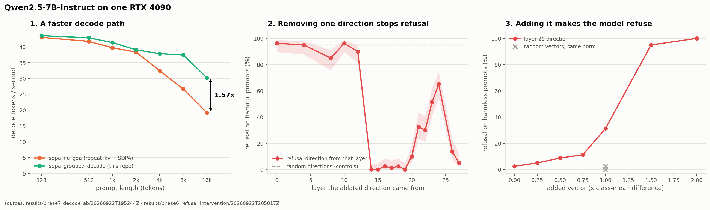

# Local LLM Lab

Measuring, speeding up and taking apart a 7B language model (`Qwen2.5-7B-Instruct`) on one RTX 4090.

[](https://github.com/ethanstoner/local-llm-lab/actions/workflows/tests.yml)




### Highlights

- **1.57x faster decoding at 16k context, 1.65x at batch 32**, from a new grouped-query decode-attention path, with no measurable fidelity loss against an FP32-attention reference.
- **A roofline with no fitted parameters** explains the slowdown it fixes: the old path holds 68-80% of its modelled ceiling at every context length and batch size, against measured ceilings of 947 GB/s and 157.5 TFLOP/s.
- **Refusal runs through one direction.** Ablating it takes refusal on harmful prompts from 95% to 0-2.5%; adding it makes the model refuse 100% of harmless ones. Random directions of the same size do neither.
- **Every headline number traces to a recorded run** in `results/`, stored with its hardware, package versions, git commit and config.

**Python · PyTorch 2.6 (CUDA 12.4) · Hugging Face Transformers · bitsandbytes · NVML · pytest · ruff · GitHub Actions**

---

## Overview

A measurement framework for open-weight language models on a single consumer GPU. It asks
three questions and acts on the answers: where inference time goes, how close the
implementation runs to what the hardware allows, and whether the model's refusal
behaviour runs through a single direction inside the network. The performance half ends
in a faster decode path; the interpretability half reproduces and extends Arditi et al.
(2024) with a causal test at two model scales.

The machine is a working desktop, not a quiet benchmarking rig, so every comparison
between two implementations is paired and order-balanced rather than trusted from a
single sweep.

## Architecture

```
configs/*.yaml (strict, validated)
      |
      v
models/        loader, precision registry, OOM guard, attention backends
      |
      +--> benchmarks/        timing primitives, sweeps, paired ABBA harness, hardware ceilings
      +--> evaluation/        teacher-forced fidelity: KL, top-1, perplexity
      +--> interpretability/  forward hooks, refusal direction, ablation / addition, causal runner
      |          (monitoring/ samples NVML and allocator state alongside every run)
      v
results/<phase>/<UTC timestamp>/   metrics + meta.json (GPU, driver, packages, git commit, config)
      |
      +--> analysis/roofline.py    modelled ceilings over finished result files
      +--> visualization/          every figure rendered from those files, with a source caption
```

## Engineering Highlights

- **Traced a 56% long-context slowdown to one `repeat_kv` call.** A byte-count roofline
  showed an ideal decoder should lose only ~6% at 16k tokens (0.9 GB of KV cache against
  15.2 GB of weights); modelling the GQA expansion, which copies the whole cache seven
  times per layer per token, accounted for the rest.
- **Wrote a grouped decode-attention backend** that stacks the seven query heads sharing
  each KV head so every cached key and value is read once. It switches between PyTorch's
  memory-efficient kernel and a float32-score grouped matmul at a measured ~1.4k-token
  crossover. Result: 19.1 to 30.2 tok/s at 16k context, 672 to 1120 aggregate tok/s at
  batch 32. `attn_implementation: auto` now selects it on builds without flash attention.
- **Built a paired ABBA benchmark harness** after a sequential A/B was confounded by
  background load: it loads the model once, swaps the backend in place, alternates order
  every round and reports the median of per-round paired ratios.
- **Found that transformers passes no padding mask to custom attention backends** (masks
  come from a separate registry), so batched passes attended to padding. Fixed it and
  re-ran every affected phase, which doubled nf4's measured KL from bf16.
- **Caught a precision bug the output text hid.** An early version of the fast path
  computed attention scores in bf16; an FP32-reference fidelity check showed it far worse
  than the kernel it replaced. Scores are now float32, guarded by a regression test that
  was confirmed to fail on the original code.
- **Designed the causal interpretability test with controls:** held-out 70/30 splits,
  three random directions and three equal-norm random vectors, a second independent
  prompt set, 95% Wilson intervals, fluency scored by an independent judge model, and
  perplexity/KL cost for every ablation. Harmful completions are classified and discarded.
- **Detected silent VRAM paging:** on Windows, fp32 on a 24 GB card ran at 2.2 tok/s
  instead of raising OOM. Both harnesses now flag cells that reach 97% of device memory.

---

## Results

Full tables, figures and reasoning: [docs/results.md](docs/results.md). How each quantity
is measured: [docs/methodology.md](docs/methodology.md). Working log, failures included:
[PROGRESS.md](PROGRESS.md).

### A faster decode path

Paired, order-balanced A/B; median of per-round paired ratios (5 rounds single-stream,
3 rounds batched). Source: `results/phase7_decode_ab/20260922T195244Z/summary.csv` and
`results/phase8_batch_sweep/20260922T200038Z/summary.csv`.

| config | before (tok/s) | after (tok/s) | paired speed-up [min, max] |
|---|---|---|---|
| 2k context | 38.3 | 39.1 | 1.02x [0.96, 1.09] |
| 4k context | 32.5 | 37.8 | 1.17x [1.10, 1.24] |
| 8k context | 26.7 | 37.4 | 1.37x [1.35, 1.44] |
| 16k context | 19.1 | 30.2 | **1.57x** [1.56, 1.59] |
| batch 32, 512 tokens | 672 aggregate | 1120 aggregate | **1.65x** [1.65, 1.72] |

Fidelity: mean next-token KL to an FP32-attention reference stays between 7e-5 and 8e-4
nats for both paths at every length, with identical top-1 agreement
(`results/phase7_decode_ab/20260922T195244Z/fidelity.csv`). Batch 64 reached 24054 of
24564 MiB, was flagged as paging and is excluded, although it would have shown a 2.1x
"speed-up".

### The roofline

Ceilings measured on this card (`results/hardware_ceilings/20260922T193832Z/ceilings.json`):
947 GB/s streaming read, 884-891 GB/s at the MLP GEMV shapes, 157.5 TFLOP/s bf16 GEMM.
Decode ceilings are bytes per token over bandwidth; prefill ceilings are FLOPs over GEMM
throughput. Measured decode on the old path sits at 0.68-0.80 of its expanded-traffic
ceiling across every context length and batch size
(`results/roofline/20260922T203346Z/roofline.csv`, column `fraction_of_applicable`).
The ceilings are modelled, not measured.

### Refusal direction (Phases 5-6)

A difference-of-means direction fitted on 70 JailbreakBench prompts per class separates
the held-out split with AUROC 0.99 at layer 20
(`results/phase5_refusal_direction/20260922T200626Z/refusal_analysis.json`). Causal
tests, 80 prompts per condition
(`results/phase6_refusal_intervention/20260922T205817Z/`):

| intervention | refusal |
|---|---|
| harmful prompts, intact | 95% (76/80) |
| harmful, one of three random directions ablated | 95%, 95%, 95% |
| harmful, direction ablated at layers 14-19 | 0-2.5% |
| harmful, layer 16 ablated (perplexity ratio 0.995) | 2.5% |
| harmful, layers 21-24 ablated (perplexity +26-36%) | 30-65% |
| harmless prompts, intact | 2.5% (2/80) |
| harmless, layer-20 direction added x2 | 100% (80/80) |
| harmless, random vector of equal norm added | 0-2.5% |

Separation is not a guide to where removal works: layer 16 (d = 2.2, well below the
peak of 3.8) removes refusal at no perplexity cost, while some of the best-separating
layers barely do. At **1.5B** (`results/phase6_refusal_intervention_1.5b/20260922T211312Z/`)
adding the direction still induces refusal, but no ablation reaches 0% without raising
perplexity by 27% or more: the single-direction story holds cleanly at 7B and only
partly at 1.5B.

### How the numbers are kept honest

- Every run directory records GPU, driver, package versions, git commit, dirty-tree flag
  and the full config; every figure is rendered from those files and captions its source.
- Implementation comparisons use interleaved ABBA rounds on one loaded model, never two
  separate sweeps.
- Fidelity is teacher-forced KL and top-1 against a reference, not exact-match text,
  which Phase 2 showed to be chaotic (fp16 vs bf16: 0.0007 nats KL, yet only 59% of
  greedy continuations match).
- Interpretability statistics come from held-out splits, with random controls and 95%
  intervals. The layer is chosen by all three of Arditi et al.'s criteria.
- A handful of diagnostic numbers from superseded runs (for example the bf16-score bug's
  KL) are not kept in `results/` and are marked *(diagnostic)* in the write-up.

**Limitations:** one GPU, one model family at two sizes, a desktop with background load,
and `transformers.generate` rather than a serving stack. See
[docs/results.md](docs/results.md#9-limitations).

---

## Getting Started

Windows, an NVIDIA GPU with 24 GB, Python 3.12.

```powershell
powershell -ExecutionPolicy Bypass -File .\scripts\setup_env.ps1        # venv, torch 2.6 cu124, pinned stack
powershell -ExecutionPolicy Bypass -File .\scripts\fetch_model.ps1 -Repo Qwen/Qwen2.5-7B-Instruct
powershell -ExecutionPolicy Bypass -File .\scripts\fetch_model.ps1 -Repo Qwen/Qwen2.5-1.5B-Instruct
powershell -ExecutionPolicy Bypass -File .\scripts\fetch_datasets.ps1
powershell -ExecutionPolicy Bypass -File .\scripts\run_all.ps1          # every phase, then the figures
```

Each phase also runs on its own, for example
`python -m src.benchmarks.interleaved --config configs/decode_ab.yaml` for the decode A/B.
Every command is in [scripts/run_all.ps1](scripts/run_all.ps1).

## Testing

```powershell
.\venv\Scripts\python.exe -m pytest tests/ -q             # 173 tests, no network
.\venv\Scripts\python.exe -m pytest tests/ -q -m "not gpu" # the 171 that CI runs
.\venv\Scripts\python.exe -m ruff check .
```

173 tests: 171 run on CPU, 2 need a CUDA device and skip themselves without one. They
cover the attention backends (including the padding-mask and bf16-score regressions),
the ABBA harness, the roofline model, hooks and interventions, statistics, fidelity
metrics, config validation and the OOM guard. CI runs ruff and the CPU suite against CPU
torch on every push.

## Project Structure

```
src/
├── models/           loader, precision registry, OOM guard, attention backends (incl. the new decode path)
├── benchmarks/       timing primitives, sweeps, paired A/B harness, hardware ceilings
├── analysis/         roofline model over finished result files
├── interpretability/ activation hooks, refusal direction, ablation and addition, causal runner
├── evaluation/       quantization fidelity metrics
├── monitoring/       NVML sampler thread, allocator accounting
├── visualization/    figures and the render CLI
└── utils/            strict YAML configs, seeding, run metadata, IO
configs/  results/  figures/  docs/  scripts/  tests/
```

## What I Learned

- **A regression test has to be shown to fail on the bug.** The first two tests written
  for the bf16-score fix passed with the bug re-injected: one used float32 inputs, and in
  the other bf16 rounded both keys to the same value. The third uses inputs bf16 can
  represent and scores it cannot.
- **On a shared machine, the noise can be bigger than the effect.** A sequential A/B put
  the baseline at 35.5 tok/s *(diagnostic, a deleted run)* against Phase 1's 44.8 for the
  same configuration.
  Only paired, interleaved rounds gave a speed-up I could trust.
- **Absence of an error is not a result.** Running out of VRAM on Windows did not raise;
  the driver paged and fp32 ran 20-60x slower. A harness that trusted the missing
  exception would have published that as fp32's speed.

## Scope and intent

The interpretability work reproduces a published result, that safety fine-tuning in chat
models is mediated by a single removable direction, because it shows how shallow this
form of alignment is. It stays on the measurement side: interventions are inference-time
hooks removed after every condition, nothing is written to the weights, no modified
weights or fitted directions are published, and harmful-prompt completions are never
stored.

## License

[MIT](LICENSE).
